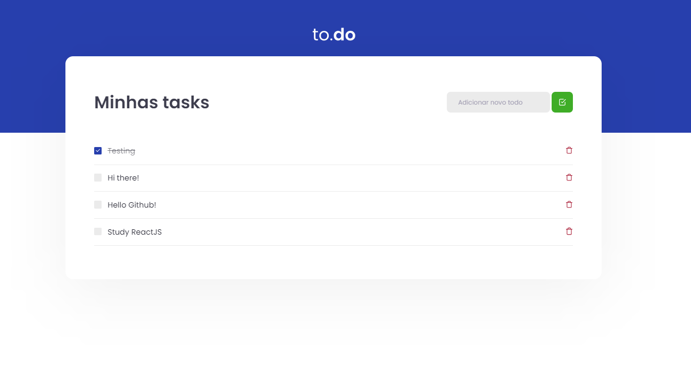

<h3 align="center">
  Challenge 01 - Practing ReactJS Concepts
</h3>

<p align="center">
  <a href="https://rocketseat.com.br" target="_blank">
    
  </a>
</p>

<br>

## 💻 About the challenge

<p align="center">
  
</p>

Practicing ReactJS Concepts with TypeScript creating the classic TODO. Everything here was created without CRA, all the structure to see how react works behind the scenes. Here I practiced: Webpack, Babel, SASS, Source Maps, Fast Refresh, and some hooks such as useState and useEffect.

</br>

## 🖱 Technologies

- ReactJS
- TypeScript
- Sass

</br>

## ✔ Running the application

```bash

# Install all the dependencies
yarn

# Start the project
yarn start

```

<br>

## 📰 License

MIT. 
